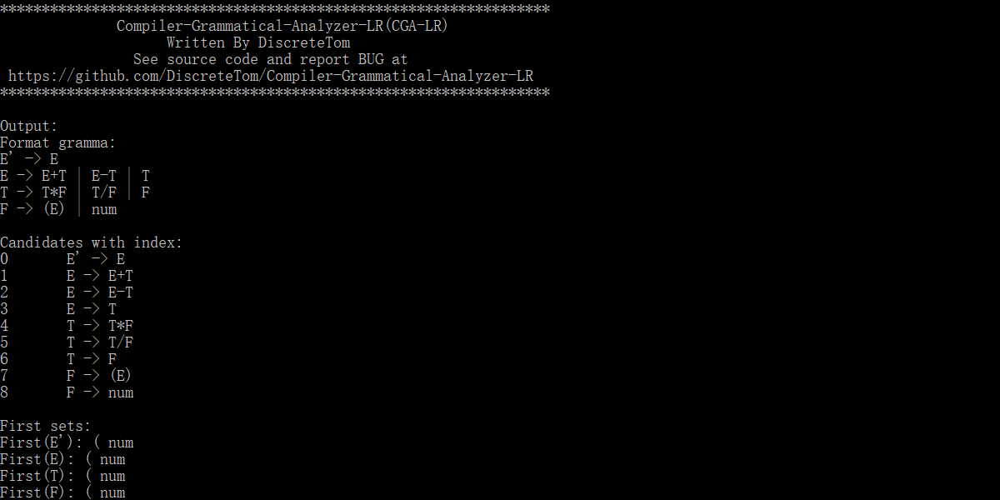
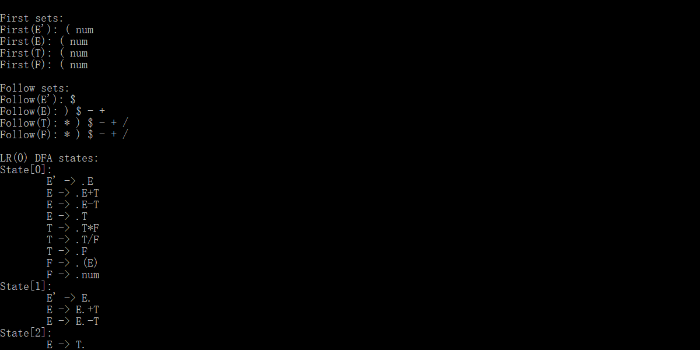
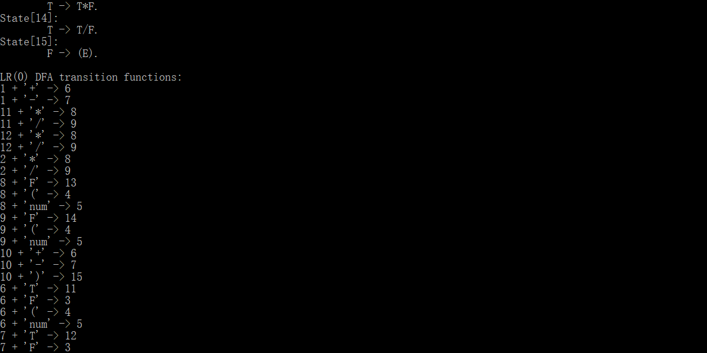
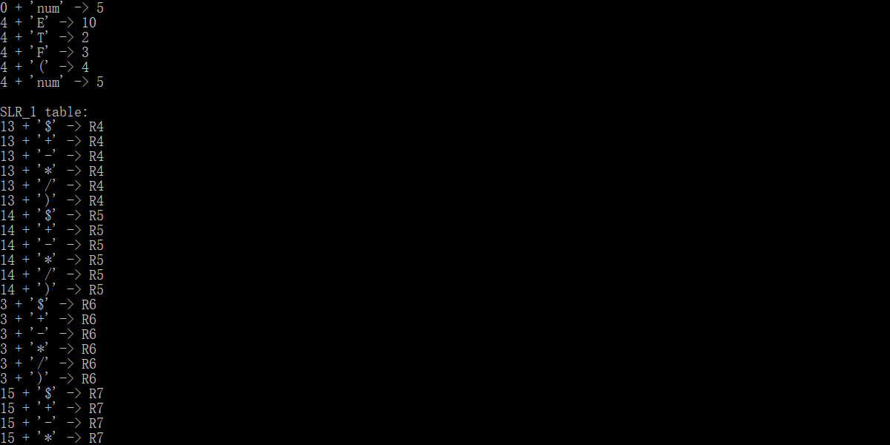
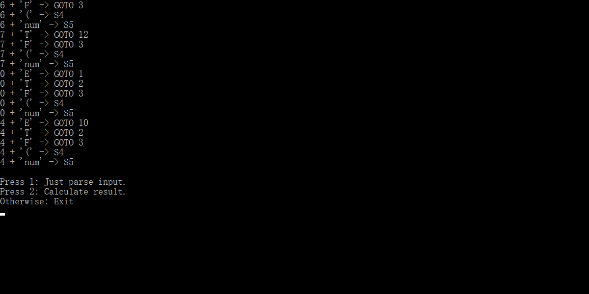
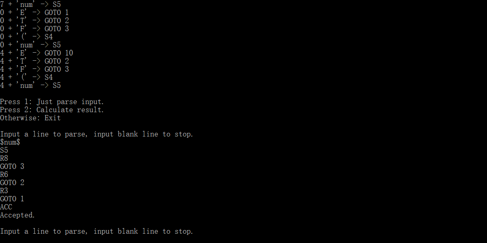
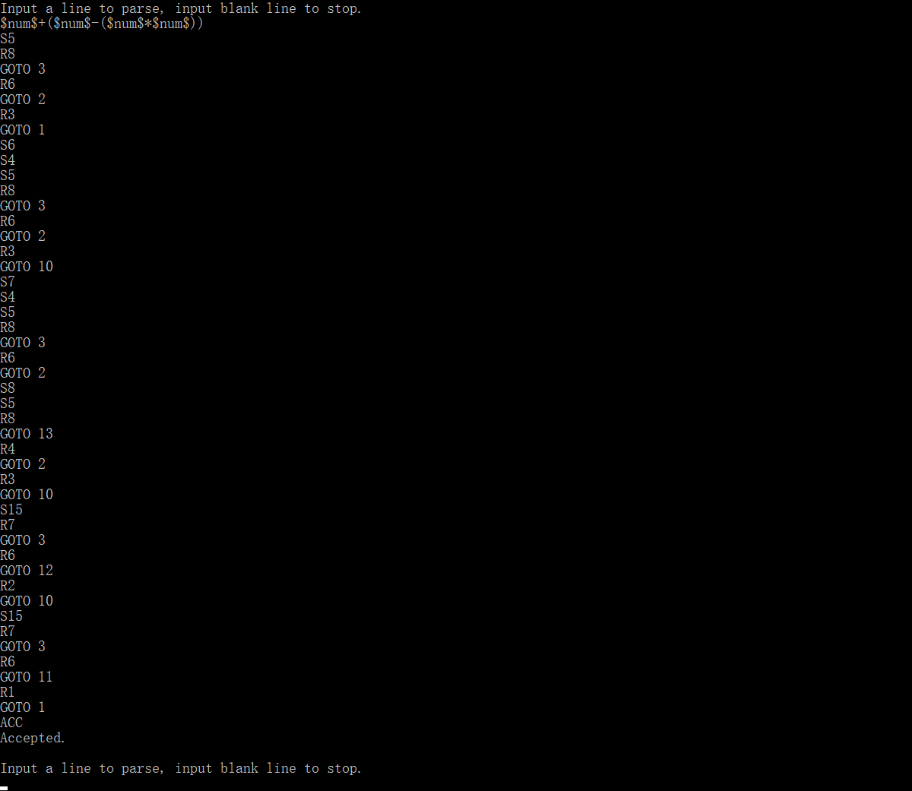
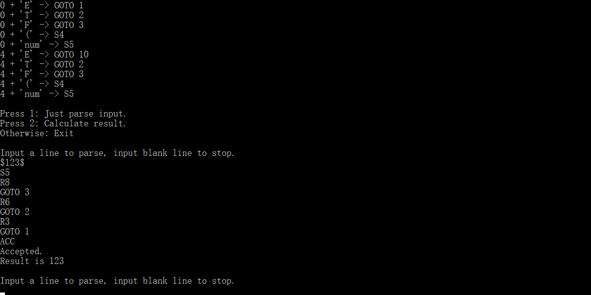
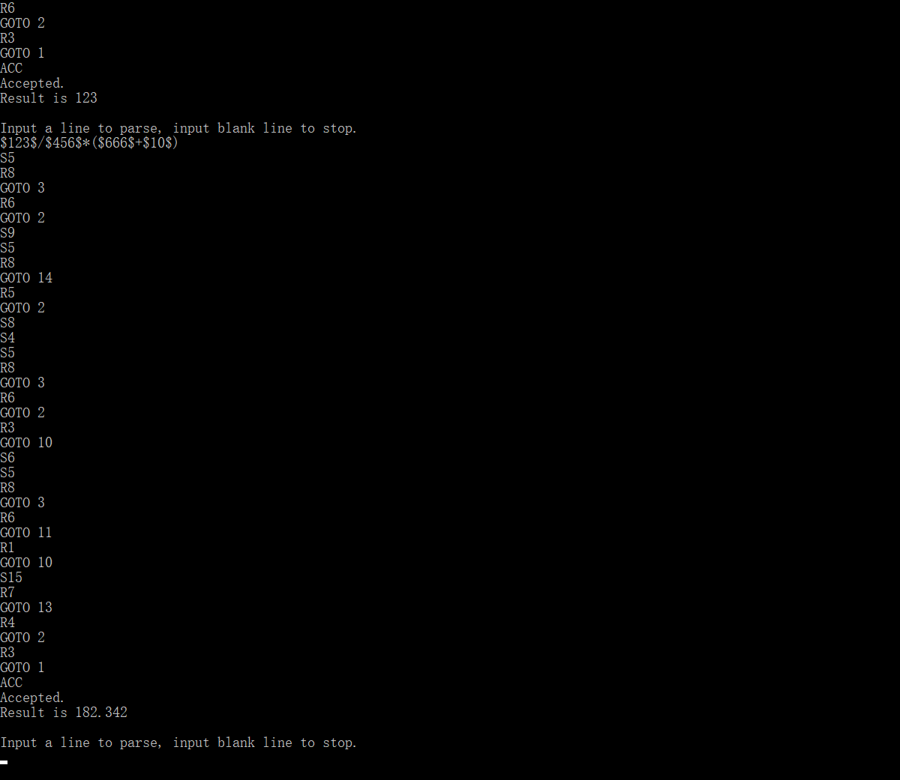

# 语法分析器的设计与实现-LR

## 环境

- 使用语言 - C++
- 开发环境 - Qt Creator 5.8.0 + MinGW
- 运行环境 - Windows 10

>虽然使用Qt Creator开发，程序仍为console application，只是使用了Qt提供的容器库。

## 概述

- 能够自动生成LR(0) DFA与SLR(1)分析表
- 程序内含翻译方案，能够计算输入表达式的结果

## 要求（摘自课本

### 实验内容

编写语法分析程序，实现对算术表达式的语法分析。要求所分析算术表达式由如下文法产生：

```
E -> E+T | E-T | T
T -> T*F | T/F | F
F -> (E) | num
```

### 实验要求

- 在对输入的算术表达式进行分析的过程中，依次输出所采用的产生式。
- 构造识别该文法所有活前缀的DFA
- 构造文法的LR分析表
- 编程实现算法4.3，构造LR分析程序

### 算法4.3

- 输入 - 文法G的一张分析表和一个输入符号串ω
- 输出 - 如果ω∈L(G)，得到ω自底向上的分析，否则报错

方法：

```c++
初始化 {
	初始状态S0压栈
	ω$存入输入缓冲区
	置ip指向ω$的第一个符号
}
do {
	令S是栈顶状态，a是ip指向的符号;
	if (action[S, a] = shift S'){
		把a和S'分别压入符号栈和状态栈的栈顶;
		推进ip，使它进入下一个输入符号;
	} else if (action[S, a] = reduce by A -> β){
		从栈顶弹出|β|个符号;
		令S'是栈顶状态，把A和goto[S', A]分别压入符号栈和状态栈的栈顶;
		输出产生式A -> β;
	} else if (action[S, a] = accept) return;
	else error();
} while (1);
```

## 设计

### 文法存储

#### 符号的存储

```c++
struct Symbol
{
	enum SymbolType
	{
		T, // terminator
		NT // non-terminator
	};
	SymbolType type;
	int index; // index in SymbolTable
};
```

定义了枚举常量T（终结符）和NT（非终结符）作为符号类型。定义结构Symbol，包含一个符号类型type和一个在符号表中的索引index

定义以下两个特殊的终结符：

```c++
const Symbol EPSILON = {Symbol::SymbolType::T, 0}; // ε
const Symbol END = {Symbol::SymbolType::T, 1}; // $
```

严格来说空串`ε`和输入结束符`$`不算是终结符。此处视为终结符方便管理

#### 符号表

```c++
template <bool isTerminatorTable>
class SymbolTable
{
private:
	Symbol::SymbolType type;
	QVector<QString> symbols;

public:
	SymbolTable();
	int getIndex(const QString &str);							// if str not exist, push it into symbols
	int getIndex(const QString &str, bool) const; // return -1 if str not exist
	QString getStr(int i) const;									// return blank QString if i is invalid
	int size() const { return symbols.size(); }
	Symbol operator[](int n) const
	{
		Symbol result = {type, n};
		return result;
	}
};
using T_Table = SymbolTable<true>;
using NT_Table = SymbolTable<false>;
```

符号表分为两种：终结符表和非终结符表。其中终结符表在构造时就需要添加符号`$`和`ε`。为了方便理解，使用`using`对不同类型的符号表进行了重命名，即T_Table和NT_Table。为了实现以上两点，使用**模板**来设计符号表，模板参数isTerminatorTable表示了此符号表是否是终结符号表。

符号表中并没有保存符号Symbol，而是保存了每个符号的字符串量，即`QVector<QString> symbols`，所以虽然可以使用`operator[]`从符号表获得符号但是不能修改符号表中已存在的内容。可以根据符号的下标来查询字符串量（即getStr方法），也可以根据符号的字符串量来查询下标（即getIndex）。所以符号表只是一个用来查询的表，并不是一个符号的容器。

函数解释：
- `int getIndex(const string &str)` - 查询字符串并返回下标。如果没有此字符串则插入此字符串
- `int getIndex(const string &str, bool) const` - 仅查询字符串并获得下标
- `string getStr(int i) const` - 查询对应下标的符号的字符串
- `int size() const` - 查询符号表容量

#### DFA与自动机

为了构造有效项目集规范族，首先定义了有效项目`struct Project`

```c++
struct Project
{
	int ntIndex;
	int candidateIndex;
	int index; // position of Point in a project
};
```

其中ntIndex表示此项目的生成式左侧非终结符的下标，candidateIndex表示此项目的生成式是此非终结符的第几个生成式。index表示项目中圆点的位置。

自动机的每个状态都是一个项目的集合，即

```c++
using State = QVector<Project>;
```

自动机保存为一个map，此map的key应该是状态和输入符号的二元组，所以定义DFA_Key:

```c++
struct DFA_Key
{
	State state;
	Symbol s;
};
```

那么DFA就是：

```c++
using DFA = QMap<DFA_Key, State>;
```

类似地，分析表也是一个map，分析表的key应该是当前状态（的下标）和输入符号的二元组。因为可以和DFA_Key都包含状态和输入符号，所以直接使用DFA_Key作为分析表的key：

```c++
using SLR_Key = DFA_Key;
```

而分析表map的value应该是一个分析动作，所以定义Action:

```c++
struct Action
{
	enum ActionType
	{
		Shift,
		Reduce,
		Goto,
		Accept
	};
	ActionType type;
	int index;
};
```

可以看到Action包含一个枚举类型ActionType，有四种取值，分别表示：
- Shift - 移进，此时index表示移进后转移到的状态下标
- Reduce - 规约，此时index表示规约使用的产生式的下标
- Goto - 转移，此时index表示应该转移到的状态下标
- Accept - 接收，此时index无意义

那么分析表的数据结构就是：

```c++
using SLR_Table = QMap<SLR_Key, Action>;
```

#### 文法表

```c++
class GrammaTable
{
private:
	// input
	QVector<Gramma> grammas;
	T_Table tTable;
	NT_Table ntTable;

	// error handling
	int lineCount;
	bool error;

	// process
	QVector<First> firsts;
	QVector<Follow> follows;
	QVector<State> states;
	DFA dfa;
	SLR_Table slrTable;

	void killBlank(QString &str) const; // discard blank chars
	bool format(QString &str) const;		// return false if format is wrong
	/**
	 * killDuplicated:
	 * eliminate same Candidate in grammas[index] if index != -1
	 * eliminate same Candidate in each Gramma when index == -1
	 */
	void killDuplicated(int index = -1);
	void killEpsilon();
	void getFirsts();
	First getFirst(const Candidate &candidate) const;
	void getFollows();
	void getDFA();							 // construct DFA
	void getState(State &state); // construct a state
	int getIndex(int ntIndex, int candidateIndex) const;
	void getSLR_Table();
	int getReduceIndex(const State &s, int &ntIndex, int &candidateIndex) const;
	void getCandidateIndex(int index, int &ntIndex, int &candidateIndex) const;
	int candidateCount() const;
	// return empty candidate if error
	Candidate parseInputToCandidate(const QString &str, QVector<int> *values = nullptr) const;
	void outputSingleCandidate(int ntIndex, int candidateIndex) const;
	void outputProject(const Project &p) const;
	void outputSymbol(const Symbol &s) const;
	void outputSLR_Key(const SLR_Key &key) const;
	void outputAction(const Action &a) const;

public:
	GrammaTable() : lineCount(0), error(false) {}

	int insert(const QString &grammaLine); // return 0 if ok, otherwise return lineCount
	/**
	 * generate first set, follow set, index of candidates and predict table
	 * return false if error
	 */
	bool generate();
	void output() const;

	bool ok() const { return !error; }
	int currentLineCount() const { return lineCount; }
	bool parse(const QString &str, bool calculateResult = false) const;
};
```

文法表包括了文法grammas、符号表tTable和ntTable、此文法生成的FIRST集与FOLLOW集、DFA、所有状态和预测分析表。

一个候选式Candidate由若干个符号Symbol组成，一个符号的生成式Gramma由若干个候选式Candidate组成

```c++
using Candidate = vector<Symbol>;
using Gramma = vector<Candidate>;
```

FIRST集和FOLLOW集是符号Symbol的集合。

```c++
using First = set<Symbol>;
using Follow = set<Symbol>;
```

变量lineCount和error用来控制错误，当错误发生时不能够继续输入文法、不能生成FIRST集和FOLLOW集、不能解析输入串。输入错误时会返回lineCount，根据此值可以定位输入的错误。

函数概述：
- private
	- `void killBlank(QString &str) const;` - 清除输入串中的空白符（空格、制表、换行）
	- `bool format(QString &str) const;` - 如果输入串没有`->`则报错
	- `void killDuplicated(int index = -1);` - 清除第index个非终结符的重复生成式。index为-1时清除所有非终结符的重复生成式
	- `void killEpsilon();` - 清除所有候选式中多余的ε
	- `void getFirsts();` - 生成所有非终结符的FIRST集
	- `First getFirst(const Candidate &candidate) const;` - 在所有非终结符的FIRST存在的情况下生成单个候选式的FIRST集
	- `void getFollows();` - 生成所有非终结符的FOLLOW集
	- `void getDFA();` - 生成DFA
	- `void getState(State &state);` - 根据当前State进行扩充从而形成一个完整的State
	- `void getIndex(int ntIndex, int candidateIndex) const;` - 根据生成式左侧非终结符的下标和生成式是此非终结符的第几个生成式来判断生成式下标
	- `void getSLR_Table();` - 生成SLR分析表
	- `int getReduceIndex(const State &s, int &ntIndex, int &candidateIndex) const;` - 根据当前状态判断是否能规约。如果能，返回规约使用的生成式下标，并把ntIndex和candidateIndex指向生成式
	- `void getCandidateIndex(int index, int &ntIndex, int &candidateIndex) const;` - 根据输入的index计算生成式在grammas中的位置，通过ntIndex和candidateIndex返回
	- `int candidateCount() const;` - 返回生成式数量
	- `Candidate parseInputToCandidate(const QString &str, QVector<int> *values = nullptr) const;` - 把字符串解析为符号串。如果values不为空，则解析输入串中的数字
	- `void outputSingleCandidate(int ntIndex, int candidateIndex) const;` - 输出单个生成式
	- `void outputProject(const Project &p) const;` - 输出一个项目
	- `void outputSymbol(const Symbol &s) const;` - 输出一个符号
	- `void outputSLR_Key(const SLR_Key &key) const;` - 输出一个分析表的key
	- `void outputAction(const Action &a) const;` - 输出一个分析动作
- public
	- `int insert(const string &grammaLine);` - 插入一行文法。如果文法出错则返回lineCount，否则返回0
	- `bool generate();` - 生成FIRST集、FOLLOW集和预测分析表，如果生成失败则返回false
	- `void output() const;` - 输出消左递归后的文法、FIRST集、FOLLOW集、预测分析表
	- `bool ok() const { return !error; }` - 判断此预测分析表是否能够正常继续输入
	- `int currentLineCount() const { return lineCount; }` - 返回当前行数，通常用来确定错误发生的位置
	- `bool parse(const string &str, bool calculateResult = false) const;` - 试图解析输入的字符串。如果calculateResult为true则输出结果。如果解析失败则返回false。

### 翻译方案设计

```
E' -> E { print(E.v) }
E -> E1 + T { E.v = E1.v + T.v }
E -> E1 - T { E.v = E1.v - T.v }
E -> T { E.v = T.v }
T -> T1 * F { T.v = T1.v * F.v}
T -> T1 / F { T.v = T1.v / F.v}
T -> F { T.v = F.v }
F -> (E) { F.v = E.v }
F -> num { F.v = num.v }
```

其中所有符号的属性`v`均为综合属性，用来保存和传递结果。`print(E.v)`用来输出结果。

### 输入设计与限制

文法已内置在main函数中，不需要输入文法。能够输入的内容为：
- 需要解析的符号串
- 需要解析的表达式

**输入符号串**时，如果输入的符号长度超过1位，需要使用两个`$`符号括起来。在输入符号串时，唯一需要括起来的符号就是`num`。示例输入：

```
$num$
$num$+$num$*$num$/$num$-$num$
($num$+($num$-($num$*($num$/($num$)))))
```

**输入表达式**时，输入的数字也需要用两个`$`括起来，不论数字长短。示例输入：

```
$123$
$123$+$123$*$123$/$123$-$123$
($123$+($123$-($123$*($123$/($123$)))))
```

>之所以使用这样的设计是因为上次写自顶向下语法分析器的时候已经写好了解析两个`$`括起内容的函数

**表达式解析时的输入限制**：毕竟不是词法分析器，输入数字时限制只能输入正整数，即两个`$`中间不能包含0-9以外的符号，但是输出可以是小数和负数。解析时会把所有由两个`$`括起的内容解析为`num`

### 关键函数设计

>此处只解释DFA和分析表的生成，以及解析函数的工作原理。关于First集和Follow集的构造，在上次自顶向下语法分析时已实现，略去。

#### DFA的生成

```c++
void GrammaTable::getDFA()
{
	// 首先清除所有状态以及之前的DFA
	states.clear();
	dfa.clear();

	// 构造第一个状态，即状态0
	State firstState;
	firstState.push_back({0, 0, 0}); // 把项目 E' -> .E 装入状态
	getState(firstState); // 根据项目中的已有状态，拓展状态而生成完整状态
	states.push_back(firstState); // 把状态0装入状态集合

	// 扩展DFA
	for (int i = 0; i < states.size(); ++i)
	{
		// 在拓展的过程中states的size可能会发生变化
		// 所以要注意边界
		State state = states[i]; // 当前状态
		QVector<State> tStates; // 临时保存由当前状态生成的状态（因为状态可能重复
		DFA tDfa; // 临时保存由当前状态生成的一些转移函数

		// 开始扩展
		for (int j = 0; j < state.size(); ++j)
		{
			// 遍历当前状态中的每个项目
			auto project = state[j];
			if (project.index < grammas[project.ntIndex][project.candidateIndex].size())
			{
				// 项目中的圆点可以右移
				// 保存右移时接收的符号
				auto sym = grammas[project.ntIndex][project.candidateIndex][project.index];
				++project.index; // 圆点右移
				if (!tDfa.contains({state, sym}))
				{
					// 临时DFA中没有此转换函数，则新建状态和转换函数
					State t;
					t.push_back(project); // 此状态目前仅有这一个项目
					tStates.push_back(t); // 装入临时状态集
					tDfa.insert({state, sym}, t); // 装入临时DFA
				}
				else
				{
					// 临时DFA中已有此转换函数
					// 把此项目装入转换函数的目标状态中
					DFA_Key key = {state, sym};
					int index = tStates.indexOf(tDfa[key]);
					tStates[index].push_back(project);
					tDfa[key] = tStates[index];
				}
			}
		}
		// 至此，当前状态中的每个项目都已经处理过了
		// 扩展临时状态集中的状态
		for (auto &s : tStates)
		{
			auto key = tDfa.key(s);
			getState(s);
			tDfa[key] = s;
		}

		// 合并DFA与临时DFA、状态集与已有状态集
		// 检查扩展后的临时状态集中的状态是否与已有的状态重复
		auto keys = tDfa.keys();
		for (auto key : keys)
		{
			int index = states.indexOf(tDfa[key]);
			if (index == -1)
			{
				states.push_back(tDfa[key]);
				dfa.insert(key, tDfa[key]);
			}
			else
			{
				dfa.insert(key, states[index]);
			}
		}
	}
}
```

#### 分析表的生成

```c++
void GrammaTable::getSLR_Table()
{
	// 先根据所有状态生成规约和接收的表项
	// 遍历所有状态
	for (auto state : states)
	{
		int ntIndex;
		int candidateIndex;
		// 判断当前状态是否存在规约项
		int reduceIndex = getReduceIndex(state, ntIndex, candidateIndex);
		if (ntIndex != -1 && candidateIndex != -1)
		{
			// 当前状态能够规约（默认只有一种规约情况
			// 判断是接收还是规约，生成表项
			for (auto s : follows[ntIndex])
			{
				Action a;
				a.index = reduceIndex;
				if (reduceIndex == 0)
				{
					a.type = Action::ActionType::Accept;
				}
				else
				{
					a.type = Action::ActionType::Reduce;
				}
				slrTable.insert({state, s}, a);
			}
		}
	}
	// 生成移进和转移的表项
	// 遍历DFA
	auto keys = dfa.keys();
	for (auto key : keys)
	{
		if (key.s.type == Symbol::SymbolType::T)
		{
			// 移进
			slrTable.insert(key, {Action::ActionType::Shift, states.indexOf(dfa[key])});
		}
		else
		{
			// 转移
			slrTable.insert(key, {Action::ActionType::Goto, states.indexOf(dfa[key])});
		}
	}
}
```

#### 输入串的解析

```c++
bool GrammaTable::parse(const QString &str, bool calculateResult) const
{
	QVector<int> values; // 用来保存每个符号的value。没有value的符号默认value为0
	Candidate candidate; // 用来保存解析输入串后得到的符号串
	if (calculateResult)
		candidate = parseInputToCandidate(str, &values);
	else
		candidate = parseInputToCandidate(str);
	if (candidate.size() == 0)
	{
		cout << "Error input.\n";
		return false;
	}
	candidate.push_back(END); // 在符号串末尾加上终止符$

	// 声明与初始化变量
	QStack<int> stateStack;
	QStack<Symbol> symbolStack;
	QStack<double> valueStack;
	stateStack.push(0);
	symbolStack.push(END);

	int index = 0; // 当前分析到的符号串的下标
	while (index < candidate.size()) // 没有分析结束时
	{
		// 根据当前状态和符号，从分析表获取分析动作
		SLR_Key key = {states[stateStack.top()], candidate[index]};
		if (!slrTable.contains(key)) // 分析表没有此项，停止分析
			break;
		auto action = slrTable[key];
		outputAction(action); // 输出动作
		cout << endl;
		switch (action.type)
		{
		case Action::ActionType::Accept: // 接收
			cout << "Accepted.\n";
			if (calculateResult)
				cout << "Result is " << valueStack.top() << endl;
			return true;
			break;
		case Action::ActionType::Reduce: // 规约
		{
			// calculate value
			if (calculateResult)
			{
				// 直接通过栈顶使用value栈中的内容计算结果
				double t = 0;
				switch (action.index)
				{
				case 1: // E -> E1 + T { E.v = E1.v + T.v }
					t = valueStack.top();
					valueStack.pop();
					valueStack.pop();
					t += valueStack.top();
					valueStack.pop();
					valueStack.push(t);
					break;
				case 2: // E -> E1 - T { E.v = E1.v - T.v }
					t = valueStack.top();
					valueStack.pop();
					valueStack.pop();
					t = valueStack.top() - t;
					valueStack.pop();
					valueStack.push(t);
					break;
				case 3: // E -> T { E.v = T.v }
					break;
				case 4: // T -> T1 * F { T.v = T1.v * F.v}
					t = valueStack.top();
					valueStack.pop();
					valueStack.pop();
					t *= valueStack.top();
					valueStack.pop();
					valueStack.push(t);
					break;
				case 5: // T -> T1 / F { T.v = T1.v / F.v}
					t = valueStack.top();
					valueStack.pop();
					valueStack.pop();
					t = valueStack.top() / t;
					valueStack.pop();
					valueStack.push(t);
					break;
				case 6: // T -> F { T.v = F.v }
					break;
				case 7: // F -> (E) { F.v = E.v }
					valueStack.pop();
					t = valueStack.top();
					valueStack.pop();
					valueStack.top() = t;
					break;
				case 8: // F -> num { F.v = num.v }
					break;
				default:
					break;
				}
			}
			// 规约状态栈和符号栈
			int ntIndex;
			int candidateIndex;
			getCandidateIndex(action.index, ntIndex, candidateIndex);
			for (int i = 0; i < grammas[ntIndex][candidateIndex].size(); ++i)
			{
				stateStack.pop();
				symbolStack.pop();
			}
			// 规约后的状态转移
			SLR_Key gotoKey = {states[stateStack.top()], {Symbol::SymbolType::NT, ntIndex}};
			auto gotoAction = slrTable[gotoKey];
			outputAction(gotoAction); // output
			cout << endl;
			stateStack.push(gotoAction.index);
			symbolStack.push(ntTable[ntIndex]);
			--index; // do not increase index
			break;
		}
		case Action::ActionType::Shift: // 移进
			stateStack.push(action.index);
			symbolStack.push(candidate[index]);
			if (calculateResult)
				valueStack.push(values[index]);
			break;
		default:
			break;
		}
		++index;
	}
	cout << "This line not belongs to this gramma.\n";
	return false;
}
```

### 工作流程设计

#### generate函数

```c++
bool GrammaTable::generate()
{
	// 判断输入文法时是否出错
	if (error)
		return false;
	// 未出错
	getFirsts(); // 生成FIRST集
	getFollows(); // 生成FOLLOW集
	getDFA(); // 生成DFA
	getSLR_Table(); // 生成分析表
	return true;
}
```

#### main函数

```c++
GrammaTable gt; // 声明文法表
QString t; // 用于保存输入串

// 文法表注入目标文法
gt.insert("E' -> E");
gt.insert("E -> E+T | E-T | T");
gt.insert("T -> T*F | T/F | F");
gt.insert("F -> (E) | $num$");

gt.generate(); // 生成FIRST集、FOLLOW集、DFA和分析表
cout << "Output:\n";
gt.output(); // 输出

while (1)
{
	// 输出提示信息
	cout << "\nPress 1: Just parse input.\nPress 2: Calculate result.\nOtherwise: Exit\n";
	// 获取当前模式
	int mode = getch() - '0';
	if (mode != 1 && mode != 2) // error input
		mode = 3;
	if (mode == 3)
		return 0;

	bool flag = true;
	while (flag)
	{
		cout << "\nInput a line to parse, input blank line to stop.\n";
		getline(cin, t);
		if (t.length())
		{
			// 未输入空串，解析
			gt.parse(t, mode == 2);
		}
		else
		{
			// 输入空串，结束循环
			flag = false;
		}
	}
}
```

## 测试与说明

### 初始输出

启动程序后生成First集、Follow集、DFA和分析表并输出这些内容：

```
******************************************************************
              Compiler-Grammatical-Analyzer-LR(CGA-LR)
                    Written By DiscreteTom
                See source code and report BUG at
 https://github.com/DiscreteTom/Compiler-Grammatical-Analyzer-LR
******************************************************************

Output:
Format gramma:
E' -> E
E -> E+T | E-T | T
T -> T*F | T/F | F
F -> (E) | num

Candidates with index:
0       E' -> E
1       E -> E+T
2       E -> E-T
3       E -> T
4       T -> T*F
5       T -> T/F
6       T -> F
7       F -> (E)
8       F -> num

First sets:
First(E'): num (
First(E): num (
First(T): num (
First(F): num (

Follow sets:
Follow(E'): $
Follow(E): - + $ )
Follow(T): - + $ ) / *
Follow(F): - + $ ) / *

LR(0) DFA states:
State[0]:
        E' -> .E
        E -> .E+T
        E -> .E-T
        E -> .T
        T -> .T*F
        T -> .T/F
        T -> .F
        F -> .(E)
        F -> .num
State[1]:
        E' -> E.
        E -> E.+T
        E -> E.-T
State[2]:
        E -> T.
        T -> T.*F
        T -> T./F
State[3]:
        T -> F.
State[4]:
        F -> (.E)
        E -> .E+T
        E -> .E-T
        E -> .T
        T -> .T*F
        T -> .T/F
        T -> .F
        F -> .(E)
        F -> .num
State[5]:
        F -> num.
State[6]:
        E -> E+.T
        T -> .T*F
        T -> .T/F
        T -> .F
        F -> .(E)
        F -> .num
State[7]:
        E -> E-.T
        T -> .T*F
        T -> .T/F
        T -> .F
        F -> .(E)
        F -> .num
State[8]:
        T -> T*.F
        F -> .(E)
        F -> .num
State[9]:
        T -> T/.F
        F -> .(E)
        F -> .num
State[10]:
        F -> (E.)
        E -> E.+T
        E -> E.-T
State[11]:
        E -> E+T.
        T -> T.*F
        T -> T./F
State[12]:
        E -> E-T.
        T -> T.*F
        T -> T./F
State[13]:
        T -> T*F.
State[14]:
        T -> T/F.
State[15]:
        F -> (E).

LR(0) DFA transition functions:
1 + '+' -> 6
1 + '-' -> 7
11 + '*' -> 8
11 + '/' -> 9
12 + '*' -> 8
12 + '/' -> 9
2 + '*' -> 8
2 + '/' -> 9
8 + 'F' -> 13
8 + '(' -> 4
8 + 'num' -> 5
9 + 'F' -> 14
9 + '(' -> 4
9 + 'num' -> 5
10 + '+' -> 6
10 + '-' -> 7
10 + ')' -> 15
6 + 'T' -> 11
6 + 'F' -> 3
6 + '(' -> 4
6 + 'num' -> 5
7 + 'T' -> 12
7 + 'F' -> 3
7 + '(' -> 4
7 + 'num' -> 5
0 + 'E' -> 1
0 + 'T' -> 2
0 + 'F' -> 3
0 + '(' -> 4
0 + 'num' -> 5
4 + 'E' -> 10
4 + 'T' -> 2
4 + 'F' -> 3
4 + '(' -> 4
4 + 'num' -> 5

SLR_1 table:
13 + '$' -> R4
13 + '+' -> R4
13 + '-' -> R4
13 + '*' -> R4
13 + '/' -> R4
13 + ')' -> R4
14 + '$' -> R5
14 + '+' -> R5
14 + '-' -> R5
14 + '*' -> R5
14 + '/' -> R5
14 + ')' -> R5
3 + '$' -> R6
3 + '+' -> R6
3 + '-' -> R6
3 + '*' -> R6
3 + '/' -> R6
3 + ')' -> R6
15 + '$' -> R7
15 + '+' -> R7
15 + '-' -> R7
15 + '*' -> R7
15 + '/' -> R7
15 + ')' -> R7
5 + '$' -> R8
5 + '+' -> R8
5 + '-' -> R8
5 + '*' -> R8
5 + '/' -> R8
5 + ')' -> R8
1 + '$' -> ACC
1 + '+' -> S6
1 + '-' -> S7
11 + '$' -> R1
11 + '+' -> R1
11 + '-' -> R1
11 + '*' -> S8
11 + '/' -> S9
11 + ')' -> R1
12 + '$' -> R2
12 + '+' -> R2
12 + '-' -> R2
12 + '*' -> S8
12 + '/' -> S9
12 + ')' -> R2
2 + '$' -> R3
2 + '+' -> R3
2 + '-' -> R3
2 + '*' -> S8
2 + '/' -> S9
2 + ')' -> R3
8 + 'F' -> GOTO 13
8 + '(' -> S4
8 + 'num' -> S5
9 + 'F' -> GOTO 14
9 + '(' -> S4
9 + 'num' -> S5
10 + '+' -> S6
10 + '-' -> S7
10 + ')' -> S15
6 + 'T' -> GOTO 11
6 + 'F' -> GOTO 3
6 + '(' -> S4
6 + 'num' -> S5
7 + 'T' -> GOTO 12
7 + 'F' -> GOTO 3
7 + '(' -> S4
7 + 'num' -> S5
0 + 'E' -> GOTO 1
0 + 'T' -> GOTO 2
0 + 'F' -> GOTO 3
0 + '(' -> S4
0 + 'num' -> S5
4 + 'E' -> GOTO 10
4 + 'T' -> GOTO 2
4 + 'F' -> GOTO 3
4 + '(' -> S4
4 + 'num' -> S5

Press 1: Just parse input.
Press 2: Calculate result.
Otherwise: Exit

```

### 符号串解析

在初始界面按下1进入符号串解析状态。

输入：

```
$num$+$num$*$num$/$num$-$num$
($num$+($num$-($num$*($num$/($num$)))))
$num$
($num$+($num$-($num$*($num$/($num$))))
$num$+($num$-($num$*($num$/($num$)))))
($num$+($num$-($nu*($num$/($num$))))
```

输出：

```
Input a line to parse, input blank line to stop.
$num$+$num$*$num$/$num$-$num$
S5
R8
GOTO 3
R6
GOTO 2
R3
GOTO 1
S6
S5
R8
GOTO 3
R6
GOTO 11
S8
S5
R8
GOTO 13
R4
GOTO 11
S9
S5
R8
GOTO 14
R5
GOTO 11
R1
GOTO 1
S7
S5
R8
GOTO 3
R6
GOTO 12
R2
GOTO 1
ACC
Accepted.

Input a line to parse, input blank line to stop.
($num$+($num$-($num$*($num$/($num$)))))
S4
S5
R8
GOTO 3
R6
GOTO 2
R3
GOTO 10
S6
S4
S5
R8
GOTO 3
R6
GOTO 2
R3
GOTO 10
S7
S4
S5
R8
GOTO 3
R6
GOTO 2
S8
S4
S5
R8
GOTO 3
R6
GOTO 2
S9
S4
S5
R8
GOTO 3
R6
GOTO 2
R3
GOTO 10
S15
R7
GOTO 14
R5
GOTO 2
R3
GOTO 10
S15
R7
GOTO 13
R4
GOTO 2
R3
GOTO 10
S15
R7
GOTO 3
R6
GOTO 12
R2
GOTO 10
S15
R7
GOTO 3
R6
GOTO 11
R1
GOTO 10
S15
R7
GOTO 3
R6
GOTO 2
R3
GOTO 1
ACC
Accepted.

Input a line to parse, input blank line to stop.
$num$
S5
R8
GOTO 3
R6
GOTO 2
R3
GOTO 1
ACC
Accepted.

Input a line to parse, input blank line to stop.
($num$+($num$-($num$*($num$/($num$))))
S4
S5
R8
GOTO 3
R6
GOTO 2
R3
GOTO 10
S6
S4
S5
R8
GOTO 3
R6
GOTO 2
R3
GOTO 10
S7
S4
S5
R8
GOTO 3
R6
GOTO 2
S8
S4
S5
R8
GOTO 3
R6
GOTO 2
S9
S4
S5
R8
GOTO 3
R6
GOTO 2
R3
GOTO 10
S15
R7
GOTO 14
R5
GOTO 2
R3
GOTO 10
S15
R7
GOTO 13
R4
GOTO 2
R3
GOTO 10
S15
R7
GOTO 3
R6
GOTO 12
R2
GOTO 10
S15
R7
GOTO 3
R6
GOTO 11
R1
GOTO 10
This line not belongs to this gramma.

Input a line to parse, input blank line to stop.
$num$+($num$-($num$*($num$/($num$)))))
S5
R8
GOTO 3
R6
GOTO 2
R3
GOTO 1
S6
S4
S5
R8
GOTO 3
R6
GOTO 2
R3
GOTO 10
S7
S4
S5
R8
GOTO 3
R6
GOTO 2
S8
S4
S5
R8
GOTO 3
R6
GOTO 2
S9
S4
S5
R8
GOTO 3
R6
GOTO 2
R3
GOTO 10
S15
R7
GOTO 14
R5
GOTO 2
R3
GOTO 10
S15
R7
GOTO 13
R4
GOTO 2
R3
GOTO 10
S15
R7
GOTO 3
R6
GOTO 12
R2
GOTO 10
S15
R7
GOTO 3
R6
GOTO 11
R1
GOTO 1
This line not belongs to this gramma.

Input a line to parse, input blank line to stop.
($num$+($num$-($nu*($num$/($num$))))
Error input.

Input a line to parse, input blank line to stop.
```

按下回车输入空行以回到初始界面。

### 表达式解析

在初始界面按下2进入表达式解析状态。

输入：

```
$123$
$66$+$66$*$66$/$66$-$66$
($123$+($789$-($789$*($123$/($123$)))))
($123$+($123$-($123$*($123$/($123$))))
$123$+($123$-($123$*($123$/($123$)))))
```

输出：

```
Press 1: Just parse input.
Press 2: Calculate result.
Otherwise: Exit

Input a line to parse, input blank line to stop.
$123$
S5
R8
GOTO 3
R6
GOTO 2
R3
GOTO 1
ACC
Accepted.
Result is 123

Input a line to parse, input blank line to stop.
$66$+$66$*$66$/$66$-$66$
S5
R8
GOTO 3
R6
GOTO 2
R3
GOTO 1
S6
S5
R8
GOTO 3
R6
GOTO 11
S8
S5
R8
GOTO 13
R4
GOTO 11
S9
S5
R8
GOTO 14
R5
GOTO 11
R1
GOTO 1
S7
S5
R8
GOTO 3
R6
GOTO 12
R2
GOTO 1
ACC
Accepted.
Result is 66

Input a line to parse, input blank line to stop.
($123$+($789$-($789$*($123$/($123$)))))
S4
S5
R8
GOTO 3
R6
GOTO 2
R3
GOTO 10
S6
S4
S5
R8
GOTO 3
R6
GOTO 2
R3
GOTO 10
S7
S4
S5
R8
GOTO 3
R6
GOTO 2
S8
S4
S5
R8
GOTO 3
R6
GOTO 2
S9
S4
S5
R8
GOTO 3
R6
GOTO 2
R3
GOTO 10
S15
R7
GOTO 14
R5
GOTO 2
R3
GOTO 10
S15
R7
GOTO 13
R4
GOTO 2
R3
GOTO 10
S15
R7
GOTO 3
R6
GOTO 12
R2
GOTO 10
S15
R7
GOTO 3
R6
GOTO 11
R1
GOTO 10
S15
R7
GOTO 3
R6
GOTO 2
R3
GOTO 1
ACC
Accepted.
Result is 123

Input a line to parse, input blank line to stop.
($123$+($123$-($123$*($123$/($123$))))
S4
S5
R8
GOTO 3
R6
GOTO 2
R3
GOTO 10
S6
S4
S5
R8
GOTO 3
R6
GOTO 2
R3
GOTO 10
S7
S4
S5
R8
GOTO 3
R6
GOTO 2
S8
S4
S5
R8
GOTO 3
R6
GOTO 2
S9
S4
S5
R8
GOTO 3
R6
GOTO 2
R3
GOTO 10
S15
R7
GOTO 14
R5
GOTO 2
R3
GOTO 10
S15
R7
GOTO 13
R4
GOTO 2
R3
GOTO 10
S15
R7
GOTO 3
R6
GOTO 12
R2
GOTO 10
S15
R7
GOTO 3
R6
GOTO 11
R1
GOTO 10
This line not belongs to this gramma.

Input a line to parse, input blank line to stop.
$123$+($123$-($123$*($123$/($123$)))))
S5
R8
GOTO 3
R6
GOTO 2
R3
GOTO 1
S6
S4
S5
R8
GOTO 3
R6
GOTO 2
R3
GOTO 10
S7
S4
S5
R8
GOTO 3
R6
GOTO 2
S8
S4
S5
R8
GOTO 3
R6
GOTO 2
S9
S4
S5
R8
GOTO 3
R6
GOTO 2
R3
GOTO 10
S15
R7
GOTO 14
R5
GOTO 2
R3
GOTO 10
S15
R7
GOTO 13
R4
GOTO 2
R3
GOTO 10
S15
R7
GOTO 3
R6
GOTO 12
R2
GOTO 10
S15
R7
GOTO 3
R6
GOTO 11
R1
GOTO 1
This line not belongs to this gramma.

Input a line to parse, input blank line to stop.
```

按下回车输入空行以回到初始界面。

## 运行截图

- 开发者信息、文法和带下标的生成式



- First集、Follow集与DFA状态



- DFA转移函数



- SLR(1)分析表



- 提示信息



- 解析简单符号串



- 解析复杂符号串



- 解析简单表达式



- 解析复杂表达式




